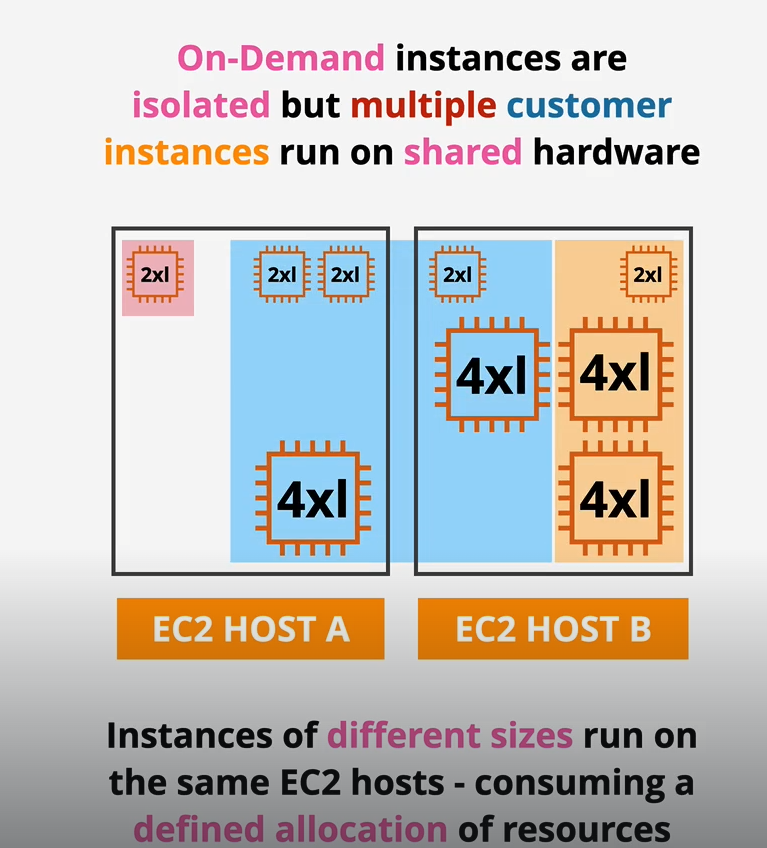

## EC2PurchaseOptions
### On Demand
- On-Demand instances are ISOLATED but multiple customer instances run on SHARED hardware

- Per-second billing while an instance is running.
- Associated resrouces such as storage consume capacity, so you will be billed regardless of instance state

### On Demand - When to choose
- Default purchase option
- No interruption
- No capacity Reservation
- Predictable pricing (NO DISCOUNT)
- No upfront Cost
- Short term workloads 
- Unknown Workloads
- Apps which can't be interrupted

### Spot
- Spot pricing is AWS selling unused EC2 host capacity for up to 90% discount
- Spot price is based on the spare capacity at a given time
- Let say two customers, A who is willing to pay 2 coins and B who is willing to pay 4 coins and AWS is asking for 2 coins
- So both customers will just need to pay 2 coins and get their spot instance
- Now AWS capacity is limited and up the cost for 4 coints
- Customers A will not pay 4 coins and will be allowed to continue to use the instance
- while customers B will now not be able to use the instances any longer because 2 coins is the MAXIMUM they willing to pay

### Spot - When to choose
- When workloads is interruptable (NEVER USE SPOT FOR UNINTERRUPTABLE WORKLOAD)
- When you need cheap price (up to 90% discounts)
- Non Time critical
- Anything that can be rerun (Parallel computing for some scientific analysis where any part can be reun when failed)
- Bursty capacity needs (Image, video processing)
- Anything which is stateless (Able to Handle disruption)

### Reserved
- Longterm consistent usage of EC2
- Commitment made to AWS to establish a long term consumption of EC2 resrouces
- While On-Demand instances is billed per second, Reserved is billed with either billed with reduced cost per second OR entirely upfront cost (no per second cost) 
- Unused Reservation means YOU will still be billed for that particular reservation
- Reservation can be purchased for a particular type of instance and locked to an availability zone or to a region
- in other words, if you locked it under an availability zone, you only receive the reserved instance benefit when u launch instance in that particular AZ
- Partial coverage of larger instance, Eg. you will get partial benefit if you used T3 xlarge when you only purchase T3 Large reserve instance
- You can choose to either commit for 1 year or 3 year (Price is reduced further but you will be locked in for longer period of time)
- Payment Structure: No-Upfront, Partial Upfront, All Upfront
- No-Upfront: Simply pay a reduced per second fee irregardless if you run the instance  (LEAST DISCOUNT)
- Partial Upfront: Partial upfront + reduced per second fee (Middle ground)
- All Upfront: No per second fee (MOST DISCOUNT)

### Reserved - When to choose
- Known usuage and require consistent access to compute and required for long term basis
- Can't tolerate interruption

### Dedicated Hosts
- Entire EC2 Host of a particular family (A,C,R) allocated to payer
- Since you are paying for the entire host, you can launch various different sizes of instances

### Dedicated Hosts - When to choose
- Might have software that is licensed based on sockets or cores in a physical machine
- Host affinity which links instances to hosts (Deletion of instances followed by creation will result in instances being launched in the same host)

### Dedicated Instances
- You run instances in a host where no other customers can use the same hardware
- You don't own or share the host. BUT EXTRA CHARGES for instances
- First, need to pay a one off houly fee for any regions, irregardless of how many you are utilizing
- Followed by fee for dedicated instances themselves 

### Dedicated Instances - When to choose
- You are in an industry where you have really strict requirements of not able to share same infrastructure with other AWS customers

### Scheduled Reserved Instances 
- Ideal for long term usuage which doesn't run constantly
- Eg. Batch Processing daily for 5 hours starting at 23:00, Weekly data, sales analysis every Friday for 24 hours
- NOT a 24/7/365 Commitment but one that you will be able to specify the frequency, duration and the time
- Restriction = Doesn't support all instance types or regions. Minimum 1,200 hours per year & 1 year term minimum

### Capacity Reservation
- Certain events such as major failures can result in a situation where there isn't enough capacity  in a region or AZ
- AWS will turn to its priority order which AWS use to delivery EC2 capacity
- AWS will delivery on any commitments in terms of reserved purchased, then on-demand, then spot 
- Capacity reservations can be useful when you have a requirement for some compute which can't tolerate interruption (Business critical applications)
- Two different component in capacity reservation, billing component and capacity component
- Both of these can be used in combination or individually 
- There are situations where you might need to reserve some capacity, but cannot justify the need to long term commit to reserved instance

- Regional Reservations provides billing discount for valid instances launched in any AZ in that region
- While flexible they don;t reserve capacity within an AZ - which is risky during major faults when capacity can be limited
- Zonal Reservations only apply to one AZ providing billing discounts and capacity reservation on that AZ
- If you launch instances in another AZ in that region, it will be full price and no capacitiy reservation
- Both needs to be commit to 1 or 3 years (Reserved Instances plan)
- Introducing On-Demand capacity reservations can be booked to ensure you always have access to capcity in an AZ when you need it 
- BUT at a full on-demand price. No term limits but you pay regardless of if you consumne it 

### EC2 Savings Plan
- Hourly commitment for a 1 or 3 year term
- A reservation of general compute $ amounts ($20 per hour for 3 years)
- Or a specific EC2 Savings Plan - flexibility on size & OS
- Compute products, currently EC2, Fargate & Lambda
- Products have an on-demand rate and a savings plan rate
- Resource usage consumes savings plan commitment at the reduced saving plan rate
- Beyond your commitment will be on-demand is used

