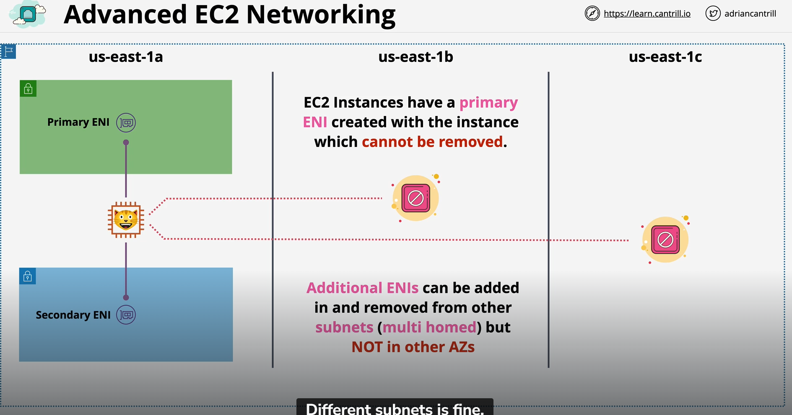
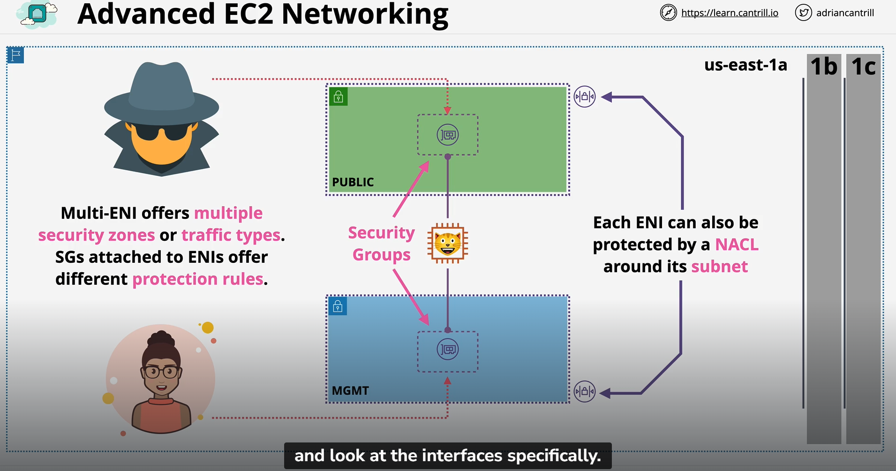
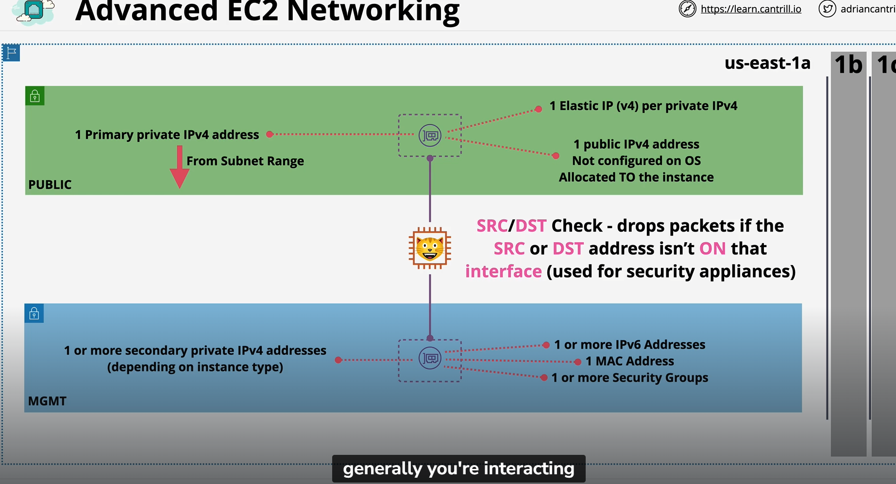

## EC2Networking

- Security groups are associated with Network interface and not EC2 Instances
- It is because ENI is inside the subnet so that NACL can be used to protect
- ENI in the public can have tigher control while ENI in the private used by system admin can be less tight

- Each ENI is allocated a single primary private IPv4 via DHCP within the range of the subnet
- Remains the same for the lifetime of the ENI
- SO every EC2 will have a single primary private IPv4 address which is static for the lifetime of the ENI
- ENI can also be allocated with one or more secondary private IPv4 addresses (Depending on instance type)
- These are all exposed to the operating system
- Note that secondary ENI can be moved from instances to instances so will the Private IPv4 Attached to the ENI
- If you launch an instance into subnet which is set to allocate public IPv4 address, the primary interface of the instnaces will be allocated with a public IP4
- It is not STATIC, Eg If stop and start instance which forces it to move between EC2 hosts then public ip will change
- It is also not exposed to the operating system
- IP traffic is translated by the internet gateway when it leaves or entering VPC 
- NEVER CONFIGURE public ip4 network interface on the OS as the translation only happen on the internet gateway
- If static public ipv4 is needed, then you can purchase something called elastic ip address and associate them to the EC2 instance
- Each ENI can have 1 or more IPv6 addresses which is routable is configured into its OS
- Each ENI canhave 1 or more SGs
- Each ENI haave 1 MAC address
- Each ENI has a flag that will perform what known as SRC/DST Check - Drops packets if the SRC or DST address isn't ON that interface (Used for security applicances)
- When you interacting with the instance networking, you are actually interacting with the primary ENI of the instance

With Each instances can have multiple ENI which leads to multiple IPv4, SG, this means
- Differnet networks is possible like management or isolated networks
- Software Licensing (MAC address linked)
- Security or Network Appliances
- Multi-homed instances with workloads/roles on specific subnets -> Webserver can interact with the application server with an ENI and DB can interact with the same applciation server with another ENI leading to different security control
- Low budget and simple HA solutions -> if the ENI is used to provide services is attached to a instances has failed, the same ENI can move to another instance providing HA or DR recovery
