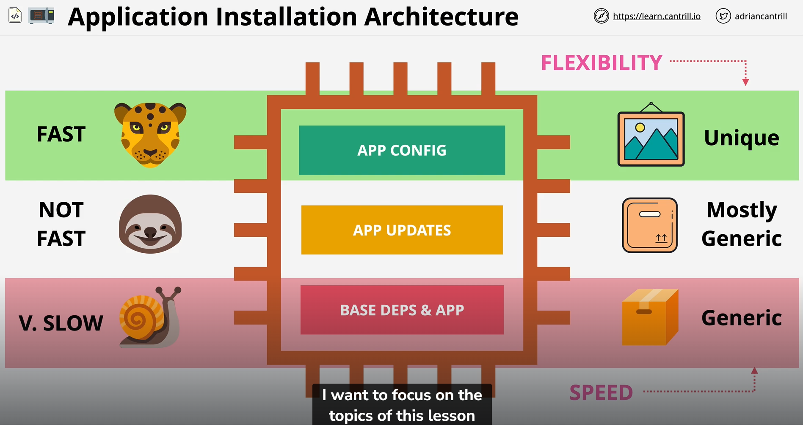

## Context
- Let say you have an application that is elastic - Autoscaling Group + Load Balancer
- Scaling Event +1 EC2 instance (NOW what happen next?)
- EC2 will be launch in it purest form will take up to 5 min
- Install, Configure and Test software will take up to ??? min
- This ??? min is service LAG which is disruptive to customers

## Application Install Architecture

- Base Deps and App are all those application dependency needed for an application to run such as python, java etc
- This are usually the slowest and as an architect, we should focus on speed on this part
- App updates are those updates (Hot fixes) or even major update that an application might need
- This are not the slowest but not the fastest either
- App Config are those configuration that an application requires to run such as nginx configuration file etc
- This are usually the fatest and as an architect, we should focus on flexibility

## BootStrapping
- Way of building EC2 instances which isn't very fast but it is super flexible
- Designed to be a flexible, automated building of EC2 instances 
- Provision EC2 Instance
- Add a script(anything can be ran) to User data using Cloud-Init
- Flexible but takes time

## AMI Baking
- Front load the time and effort required to install and configure an application
- Launch a master EC2 Instance
- Perform the time consuming tasks
- Create AMI from that instance
- Because we have already front load the time taken to install and configure, AMI can be used to deploy many instances quickly 
- Trade off is harder to adjust stuff once the ami is baked
- So it would be better to bake the time consuming process where the parts changes relatively infrequently

Note that you can use the combination of both to create EC2 instances allow to priorites both time and flexibility
