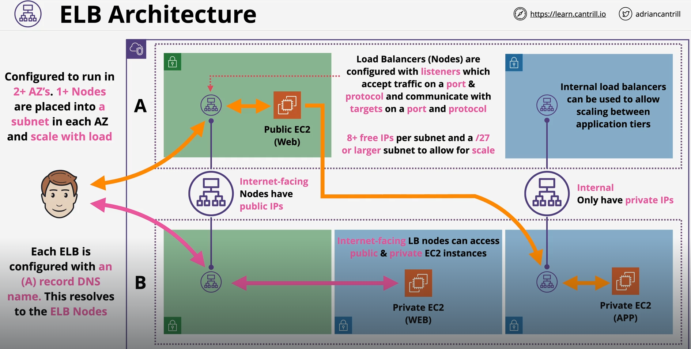
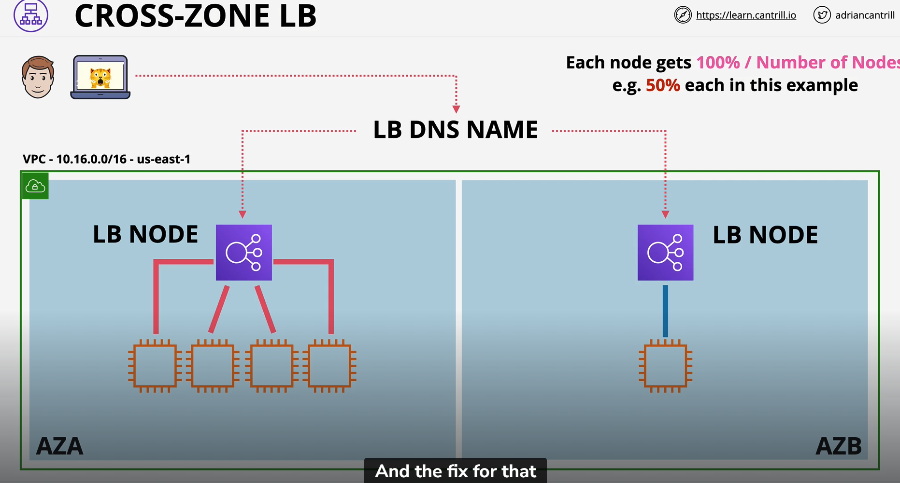
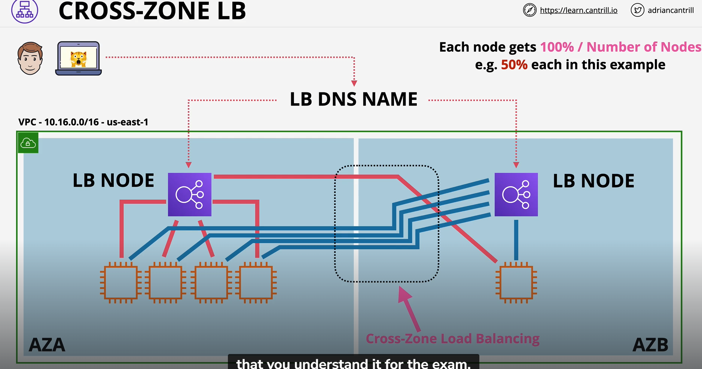
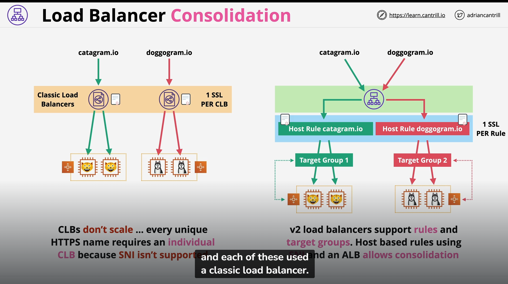
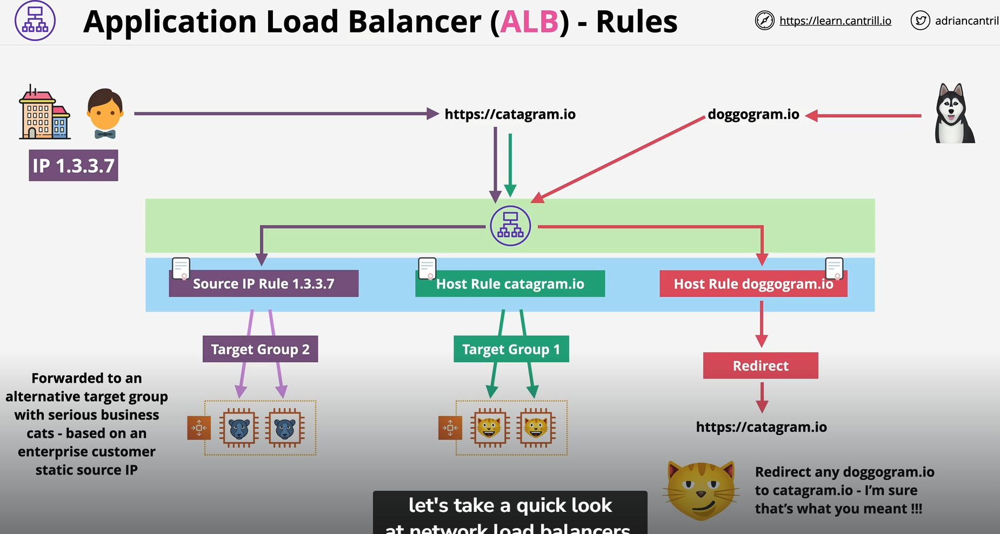

## Elastic Load Balancer Architecture (ELB)

- You can use Ipv4 or dualstack
- Required to pick ONE subnet in EACH of the TWO or more AZ
- ELB will then deploy load balancer nodes into each of those subnet
- ELB will have a single A record which points to all of the ELB nodes (Distributed equally)
- ELB is HA as well, will scale accordingly with load in the Subnet you have provided
- It can be Internet facing (will have both private and public ip addresses) or Internal facing (only have private ip address)
- Listener configuration is the configuration of how to handle the incoming network (Eg. Which port or protocol) 
- ELB needs 8 or more free IP addresses in the subnets For EG. /28 -> 16 ip addresses - 5 AWS reserved = 11 free per subnet which only leave 3 free ip address if ELB is deployed
- AWS recommends at least /27 subnet

## Cross Zone LB

- Originally LB nodes were restricted to distribute connections to instances within the same AZ
- In the above example AZB instances would receive 50 percent of the loads whereas AZA instances would only receive 12.5 percent each

- To solve this problem, cross zone LB was introduced
- Now every connections can be distributed evenly across AZs ensuring that there is equal loads on every instances
- It is enabled as default

## Summary
- ELB is a DNS A record pointing at 1+ nodes per AZ
- Nodes (in one subnet per AZ) can scale automatically as load increase
- Internet-facing means nodes have public IPv4 IPs
- Internal is private only IPs
- EC2 doesn't need to be public to work with a internet facing LB
- Listener Configuration controls what the LB does
- 8+ Free IPs per subnet and /27 subnet to allow scaling

## Session State
- Session state is server-side piece of information
- Persists while you interact with the application, Eg. Shopping Cart, Workflow Position, Login State
- Session State loss = User Experience (UX) Issues
- Either stored on a server or externally (Stateless)
- Extremely crucial when your application is stateful, Eg 1 LB -> 3 Instances(A,B,C)
- If user bob data is currently established and stored in instance B, and for some reason instance B die
- LB will now redirect bob to either instance A or C which does not have bob session data (problem)

## Session Stickiness
- With no stickiness, connections are distributed across all in-service backend instances. Unless an application correctly handles user-state this can cause user logoffs or shopping cart losses
- When session stickiness is enabled, when user made a requrest to ALB -> ALB will generate a cookie called AWSALB and deliver to the user client
- Stickiness generates a cookie which locks the device to a single backend instance for a duration (1 sec to 7 days)
- Cookie is provided from the user to the ALB with every requests
- This will allow the user to use the same backend instance, user will maintain a consistent connection to a same backend instance
- Disadvantages include uneven load on backend instances because users are locked to a particular instance
- session move on when cookie expire or instance failure
- ONLY ENABLE when an application doesn't use external sessions

## History
- 3 Types of ELB 
- Split between v1 (avoid/migrate) and v2
- Classic Load Balancer (v1) introduced in 2009 - can load balance http and https and lower level protocol, it is not layer 7 device
- Does not understand HTTP protocol header , only 1 SSL per CLB
- ALB (v2) - Layer 7 devices, support HTTPs/Websocket
- NLB - Layer 4 devices - support TCP, TLS, UDP
- v2 = faster, cheaper, support target groups and rules

## Application and Network LB

### ALB
- Layer 7 load balancer -> Listens on Https
- No other layer 7 protocols (SMTP, SSH, Gaming, ...)
- and NO TPC/UDP/TLS Listeners
- L7 content type, cookies, custom headers, user location and app behaviour
- HTTP HTTPS always terminated on the ALB - NO UNBROKEN SSL which means a new connection is made to the application
- ALBs MUST have SSL certs if HTTPS is used
- ALBs are slower than NLB .. more levels of the network stack to process
- Health checks evalaute application health at layer 7

### ALB - Rules
- Rules direct connections which arrive at a listener
- Processed in priority order
- Default rule = catchall
- Rule conditions: host-header, http-header, http-request-method, path-pattern, query-string & source-ip
- Actions: forward, redirect, fixed-response, authenticate-oidc & authenticate-cognito

Example

### NLB 
- Layer 4 LB ... TCP, TLS, UDP, TCP_UDP
- No visibility or understanding of HTTP or HTTPS
- No headers, no cookie, no session stickiness
- REALLY FAST (millions of rps, 25% of ALB latency)
- .. SMTP, SSH, Game Servers, financial apps(Not http/s)
- Health checks JUST check ICMP /TCP handshake ..NOT app aware
- NLB can have static IP's - useful for whitelisting
- Forward TCP to instances .. unbroken encryption
- Used with private link to privde services to other VPCs

### ALB vs NLB
- Unbroken encryption ... NLB
- Static IP for whitelisting ... NLB
- Fastest performance ... NLB
- Protocols not HTTP or HTTPS ... NLB
- Privatelink ... NLB
- Otherwise ... ALB
