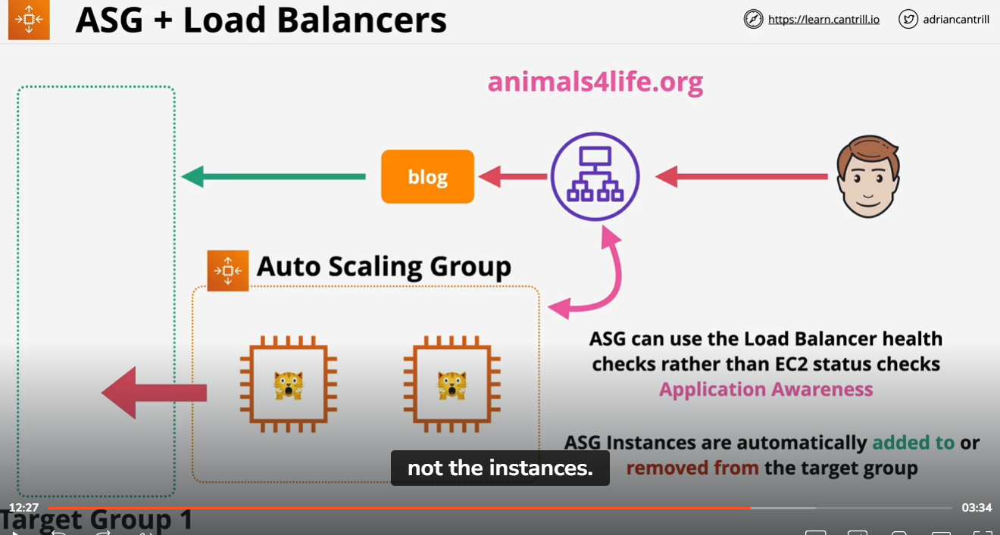
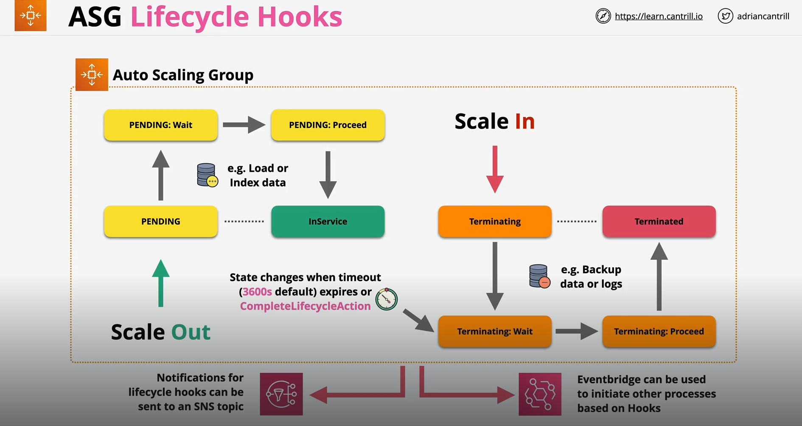
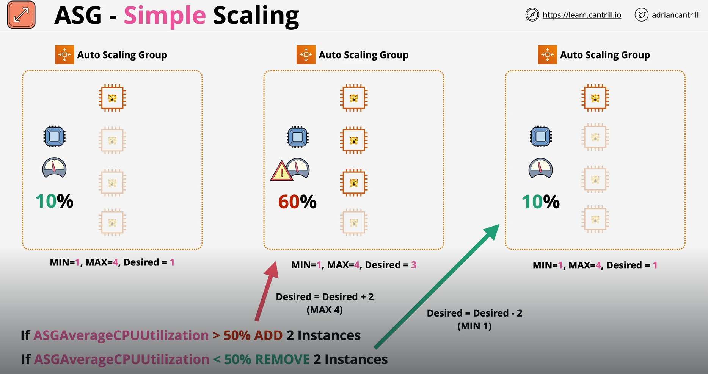
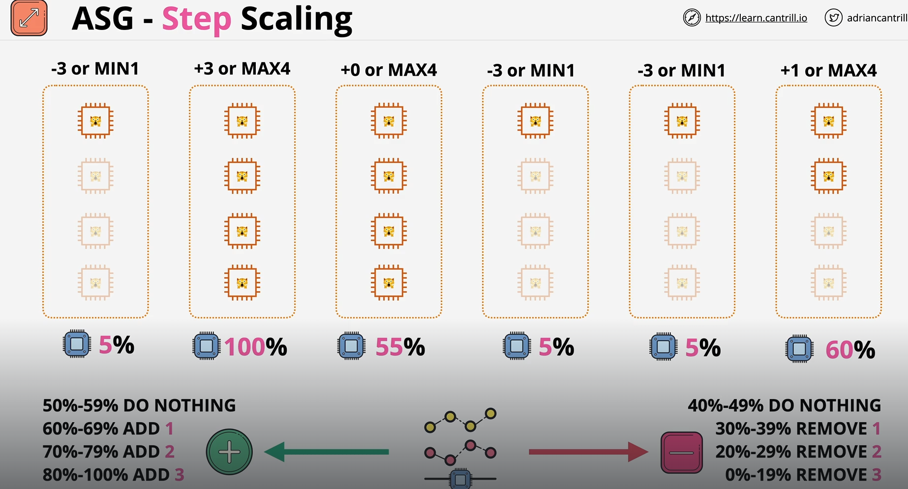
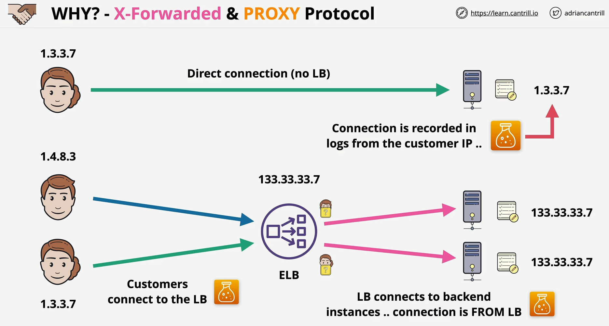

## Auto Scaling Groups
- Automatic Scaling and Self-Healing for EC2
- Uses Launch Templates (EC2 Configuration Definition)
- Has Minimum, Desired and Maximum Size 
- Keep running instances at the Desired Capacity by provisioning or terminating instancess
- Scaling Polcies automate based on metrics (Eg. CPU Load)
- Will try to even out the instances in subnets that is configured to ASG (Eg. 3 Subnets, 3 Instances -> Probable that each subnet will have one instance)
- Does Health Check (By default is the EC2 status check), If EC2 status check failed, ASG will remove the instance and launch another one (Self-Healing)

## ASG (Scaling Policies)
- Manual Scaling - Manually adjust the desired capacity
- Scheduled Scaling - Time based adjustment (when you have known period where usage will be high or low)
- Dynamic Scaling
    - Simple - A pair of rules (One to launch and one to terminate Eg. CPU above 50% +1, CPU Below 50% -1 or a length of SQS)
    - Stepped Scaling - Bigger +/- based on difference (Eg. CPU above 80% +3 CPU above 50% +1)
    - Target Tracking - Desired Aggregate CPU = 40% ... ASG will handle it to maintain the 40%
- Cooldown Period - How long to wait at the end of a scaling action before doing another. 

## ASG Scaling Process
- Launch and Terminate - SUSPEND and RESUME (EC2 will not be launch if set to SUSPEND, inverse is true as well)
- AddToLoadBalancer - add to LB on launch
- AlarmNotification - Accept notification from CloudWatch
- AZRebalance - Balances instances evenly across all of the AZs
- HealthCheck - Instance health checks on/off
- ReplaceUnhealthy - Terminate unhealthy and replace
- ScheduledActions - ASG will perform any scaling action anot
- StandBy - use this for intances 'InService vs Standby'

## ASG + Load Balancers

- As instances are provisioned in the ASG, it will automatically added into the target group 1 which the ALB is forwarding network to 
- Customed Health Check of ALB can be used ASG to performed health check 
- Eg. Monitor the state of HTTP and HTTPS requests (Application aware health check)
- WARNING: If you have a health check that is checking for Database access is failing due to Database failure -> ASG Health Check will failed
- ASG will start removing instance and reprovision when EC2 is not the problem

## ASG Lifecycle Hooks
Lifecycle hooks enable you to perform custom actions by pausing instances as an Auto Scaling group launches or terminates them. When an instance is paused, it remains in a wait state either until you complete the lifecycle action using the complete-lifecycle-action command or the CompleteLifecycleAction operation, or until the timeout period ends (one hour by default).

- Custom Actions on instances during ASG actions
- During Instance launch or Instance terminate transitions, you are not able to do anything
- Lifecycle hooks causes instances to paused within the flow (wait)
- until a timeout happened (1hour default) -> then either CONTINUE or ABANDON ASG action
- or you can resume the ASG process using CompleteLifecycleAction
- Can be integrated with EventBridge or SNS Notifications to allow systems to perform event driven processing

- In Scale Out operation, Rather than directly transition from PENDING -> InService upon launch instance
- Can hook into the lifecycle which allow us to do custom action .. PENDING -> PENDING: Wait
- Eg Load or index some data
- Once done PENDING: Wait -> PENDING: Proceed -> InService
- Same process for scale in operation

## ASG Scaling Policies (In Depth)
With step scaling and simple scaling, you choose scaling metrics and threshold values for the CloudWatch alarms that trigger the scaling process. You also define how your Auto Scaling group should be scaled when a threshold is in breach for a specified number of evaluation periods.

Step scaling policies and simple scaling policies are two of the dynamic scaling options available for you to use. Both require you to create CloudWatch alarms for the scaling policies. Both require you to specify the high and low thresholds for the alarms. Both require you to define whether to add or remove instances, and how many, or set the group to an exact size. 

The main difference between the policy types is the step adjustments that you get with step scaling policies. When step adjustments are applied, and they increase or decrease the current capacity of your Auto Scaling group, the adjustments vary based on the size of the alarm breach.

- ASGs Do not need scaling polices - they can have none
- Manual Scaling - Testing or Urgent time

### Simple Scaling

- Process an actions which occur when an alarm moved into alarmed state
- Eg. Adding one instance if CPU utilization is above 40% or Removing one instance if CPU utilization is less than 40%
- Scaling is inflexible, adding or remove a static number based on the alarm

### Stepped Scaling

- Increased or Decreased the desired capacity based on a set of scaling adjustment based on the size of the alarm breach
- Eg. If CPU is between 50-60 percent -> Do nothing
- If CPU is between 60-70 -> Add 1 instance
- If CPU is between 70-80 -> Add 2 instance
- If CPU is between 80-90 -> Add 3 instance
- Same in reverse
- ALWAYS BETTER than Simple Scaling

### Target Tracking
- Eg. CPU utilization, average network in, average network out, ALB request count per Target
- Define an ideal target value so ASG can track against for that metrics
- Eg. Ideal value for CPU utilitization should be 50%, and ASG will scale accordingly in order to maintain that value
- Further away the value is to the ideal value, the more extreme an action would be

### Scaling based on SQS - ApproximateNumberOfMessagesVisible
- As more messages are added to the queue, EC2 will scale out
- As the SQS queue is getting empty, EC2 will scale in

## ASG Health Checks
Amazon EC2 Auto Scaling can determine the health status of an instance using one or more of the following:
- Status checks provided by Amazon EC2 to identify hardware and software issues that may impair an instance. The default health checks for an Auto Scaling group are EC2 - status checks only.
- Health checks provided by Elastic Load Balancing (ELB). These health checks are disabled by default but can be enabled.
- Your custom health checks.

- EC2 - Stopping, Stopped, Terminated, Shutting DOwn or Impaired (not 2/2 status) = UNHEALTHY
- ELB - Healthy = Running & passing ELB health check ... can be more application aware (Layer7)
- Custom - Instances marked healthy & unhealthy by an external system
- Health Check grace period (default 300s) - Delay before starting checks... allows system launch, bootstrapping and application start (ASG keeps provisioning and deprovisioning EC2 without any reason)

## Connection Draining
Allows connections to be gracefully removed from a load balancer as an instance is going out of service
- What happens when instances are unhealthy...or deregistered
- Normally all connections are closed & no new connections will be made
- Connection drawining allows in-flight requests to complete
- CLASSIC LOAD BALANCER ONLY - Option is defined on the CLB
- Timeout: Between 1 and 3600 seconds (Default 300)
- The status will appears to be InService: Instance deregistration current in progress
- Auto Scaling waits for all connections to complete or Timeout

## Deregistration Delay
In order to provide a first-class user experience, you’d like to avoid breaking open network connections while taking an instance out of service, updating its software, or replacing it with a fresh instance that contains updated software. Imagine each broken connection as a half-drawn web page, an aborted file download, or a failed web service call, each of which results in an unhappy user or customer. You can now avoid this situation by enabling the new Connection Draining feature for your Classic Load Balancers or Deregistration delay on ALB, NLB or GWLB
- Supported on ALB, NLB and GWLBs
- Defined on the Target Group instead of the LB (connection draining)
- Stops sending requests to deregistering targets
- Existing connections can continue until they complete naturally or the deregistration delay is reached
- Defautl 300 seconds (0-3600 seconds)

## X-Forwarded-For & Proxy Protocol
X-Forwarded-For and Proxy protocol are two alternative versions of gaining visibility of original client IP address when using proxy servers or load balancers

- In Direct connection to LB, IP address of the client can be recorded (used for logging, security, localization)
- Using LoadBalancer, Client IP address is lost in the backend instances, it will have the LB Ip address instead

### X-Forwareded
- A set of HTTP headers (only works with HTTP/S)
- eg. X-Forwarded-For: client
- Header is added or appended by proxies/LBs
- Client is left most in the list
- Eg. X-Forwarded-For: 1.3.3.7, proxy1, proxy2...
- Backend web server needs to be aware of this header
- Connections is from LB, but X-Forwarded-For contains original client ip address
- Supported for CLB & ALB, NOT SUPPORTED NLB (Because it is layer 4)

### PROXY Protocol
- Proxy Protocol works at Layer 4
- Additional layer 4 (tcp) header .. Works with a range of protocol (including HTTP and HTTPS)
- Works with CLB(v1) and NLB(v2 - binary encoded)
- End to End encryption - eg. unbroken HTTPS (tcp listener) only Proxy protocol can be used
- use PROXY Protocol, you can't add a http header, it isn't decrypted

