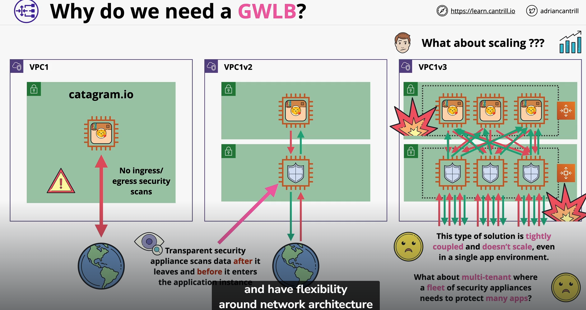
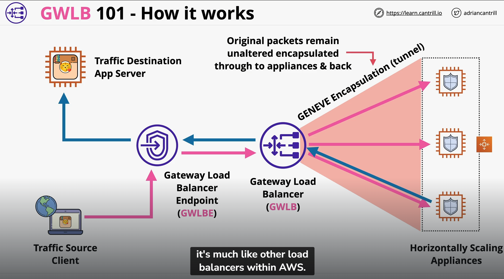
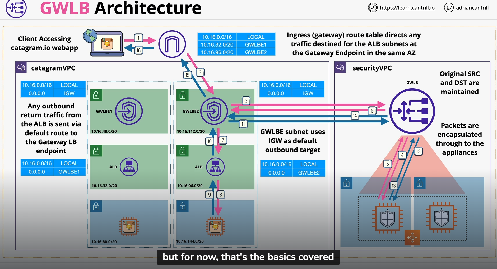

## Gateway Loadbalancer
Gateway Load Balancers enable you to deploy, scale, and manage virtual appliances, such as firewalls, intrusion detection and prevention systems, and deep packet inspection systems. It combines a transparent network gateway (that is, a single entry and exit point for all traffic) and distributes traffic while scaling your virtual appliances with the demand.

### Why do we need a GWLB?

- This security virtual appliances doesn't scale well as your own application scale out
- Help you run and scale 3rd party appliances
- things like firewalls, intrusion detection and prevention systems
- monitoring the Inbound and Outbound traffic
- GWLB endpoints which traffic enters/leaves via these endpoints
- GWLB balances across multiple backend appliances (security software)
- Security appliances needs to review the network packets as they're send or as they're received Eg. Source Ip and Destination Ip
- This might not work where the security appliances are hosted from because they are not the intended location
- GWLB uses a tunneling protocol (GENEVE) where the traffic and metadata will be encapsulated and be transferred

### GWLB 101

- When traffic is travelling to the traffic destination app server via the GWLBE
- When it reached the GWLBE, It will be directed to the GWLB via route in route table specified 
- Packets encapsulated via GENEVE remain unaltered through the security appliances for inspection
- Once finished, packets can resume to the original destination

### GWLB 101 with VPC
