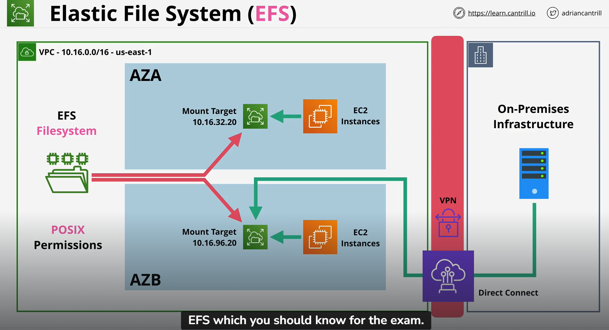
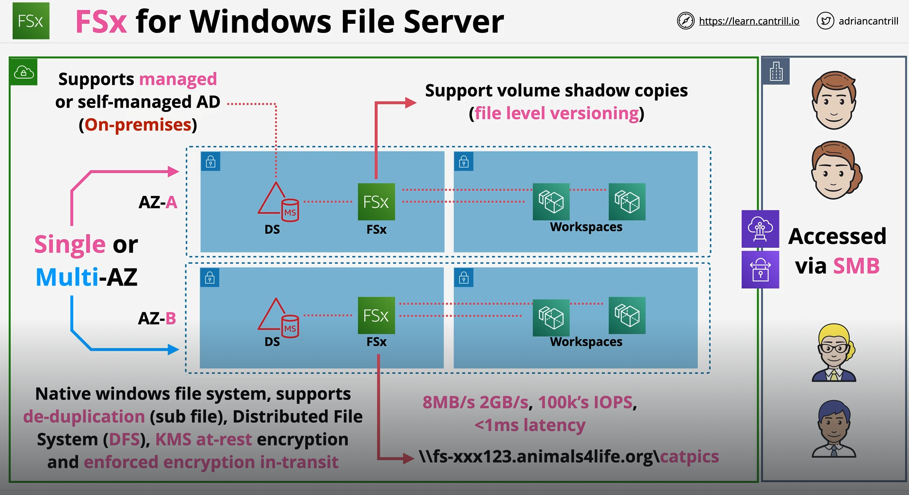
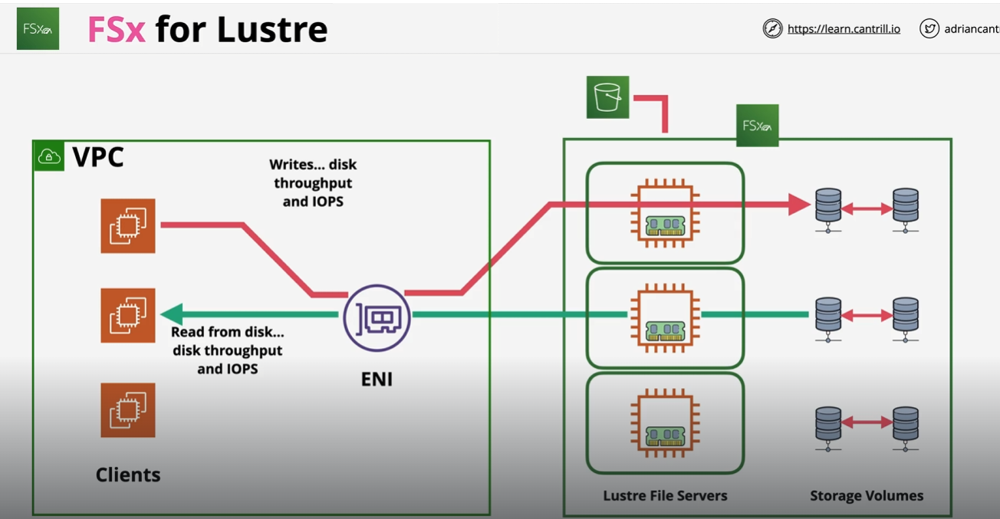

The Elastic File System (EFS) is a shared file system within AWS based on the Network File System (NFS)
It can be mounted on linux EC2 instances, or on-premises servers as long as private networking exists between that network and AWS.

## EFS

- EFS is an implementation of NFSv4
- EFS filesystems can be mounted in Linux
- Shared between many EC2
- Private Service, via mount targets inside a VPC (Isolated to the VPC)
- For fully HA, Mount target should be in every availability zone that a VPC uses
- Can be accessed from on-premises - VPN or DX to the VPC
- Linux ONLY
- General Purpose and Max I/O PERFORMANCE Modes
- GP is for ideal for latency sensitive use cases, web servers, content management systems, home directories, general file serving
- Max I/O can scale to higher levels of aggregate throughput and operations per second: Tradeoff of increased Latency, so this are suited for applications that are highly parallel, Eg. workloads such as big data media processing, scientific processing
- Bursting and Provisioned THROUGHTPUT Modes
- Bursting mode works like GP2 volumes inside EBS, so it has a burst pool, but the throughput scales with the size of the file systems, ie more data you store in filesystem the better performance you will get
- Provisioned mode you have to specify thorughtput requirements separetely from size of data you store
- Standard and Infrequent Access (IA) Classes
- IA is lower cost but should be use to store data that is infrequently accessed
- Standard is used when you going to access the data frequently that you have stored
- Lifecycle Policies can be used with classes to move data between classes

## FSx for Windows File Server
FSx for Windows Servers provides a native windows file system as a service which can be used within AWS, or from on-premises environments via VPN or Direct Connect
FSx is an advanced shared file system accessible over SMB, and integrates with Active Directory (either managed, or self-hosted).
It provides advanced features such as VSS, Data de-duplication, backups, encryption at rest and forced encryption in transit.

- Fully managed native windows file servers/shares
- Designed for integration with windows environments
- Integrates with Directory Service or Self-Managed AD
- Can be deployed in Single or Multi-AZ within a VPC
- Even in Single AZ mode, the backend uses replication within that availability zone to ensure it is resilience to hardware failure 
- On-demand and Scheduled Backups 
- Accessible using VPC, Peering, VPN, Direct Connect

- Can connect to both AWS Directory Services or directly to on premises AD
- access via double back slash DNS name and share notation 
- Allow volume shadow copies (file level versioning), user can see multiple file versions and initiate restores from client side
- highly performant 8MB/s to 2 GB/s, 100k IOPS, <1ms latency

### Exam tips
- VSS - User-Driven Restore of file or folder 
- Native file system accessible over SMB
- Uses Windows permission model 
- Supports DFS .. scale-out file share structure Eg. group multiple file shares in one enterprise-wide structure or use DFS for fileshare replication
- When running a windows server with shared filesystem is not ideal (admin overhead) then pick FSx for windows file server (Managed - no file server admin) 
- Integrates with DS and your own directory

## FSx for Lustre
FSx for Lustre is a managed file system which uses the FSx product designed for high performance computing
It delivers extreme performance for scenarios such as Big Data, Machine Learning and Financial Modeling

- Managed Lustre - Designed for High Performance Computing - LINUX Clients (POSIX)
- Designed for Machine Learning, Big Data, Financial Modelling
- 100's GB/s throughput & sub millisecond latency
- Two Deployment types - Persistent or Scratch
- Scratch - Highly optimised for Short term no replication & fast (NO HA Resilience)
- Persistent - Longer term, HA(in one AZ ONLY), self-healing(If hardware fail, AWS will replace it automatically) (one AZ cuz needs to delivery high performance)
- Accessible over VPN or Direct Connect

### What exactly is FSx for Lustre, How does it works
- Accessible from a VPC and anything connected to that VPC via private networking (like EFS)
- Can associate with a repository like an S3 Bucket, S3 objects can be access in the filesystem
- When they are first accessed, data is lazy loaded from  S3 as it is needed, so not all objects in bucket is in the FSx
- Can synced any changes made in the FSx back to the S3 Bucket using the hsm_archive command
- This means that FSx Lustre and S3 Repository is not in any way coupled together and doesn't automatically sync up with one another
- What application will be using will be data in FSx Lustre and not S3 Repository
- Lustre splits data up when it stores it to disc
- Metadata such as filename, timestamp, permission are stored in Metadata Targets (MST)
- Objects are stored on called object storage targets (OSTs) (Each OST is 1.17 TiB in size)
- Through this splitting, the performance of lustre is achieved
- Baseline performance based on size of the data stored
- Size - min 1.2TiB then increments of 2.4TiB
- For Scratch - Base 200MB/s per TiB of storage
- For Persistent - it offers 50MB/s, 100MB/s, 200MB/s per TiB of storage
- Burst up to 1,300 MB/s per TiB (Credit System) Earn credit when you using a performance level below your baseline

- Clients that have lustre software installed to interact with Lustre FS in the VPC you managed
- Depending on the size of storage, product deploys a number of storage servers that has in memory cache (allow faster access to frequently use data)
- Larger size of storage -> More Lustre Server -> more aggregated throughput and IOPS delivered into your managed VPC via a single ENI
- Lustre run in ONE AZs so one ENI is only needed

### Key point
- Scratch is designed for pure performance
- short term or temporary workloads
- no HA .. no Replication
- Larger file systems means more servers, more disks and more chance of failure
- Persistent has replication within ONE AZ only
- Auto-heals when hardware failure occurs
- Data might be loss if AZ or hardware failure in both types but Backup to S3 can be done (Manual or AUtomatic 0.35 day retention)

