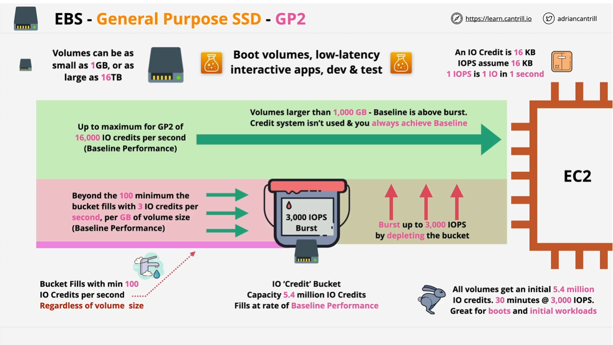

## EBS
gp2 volumes are burstable on demand while gp3 volumes do not require “burst mode” to deliver optimal performance as demand increases. Gp3 are also a newer, more cost-effective typoe of Amazon EBS General Purpose SSD-backed volumes.   
- GP2 default AWS SSD based storage
- GP3 newer storage type

### General Purpose SSD - GP2

- Volumes can be ranged from 1Gb to 16Tb, with IO credit allocation
- 1 IO credit = 16KB chunk of data => 1 IOPS = 16KB in 1 sec, Eg. If transferring 160Kb of data, which represents 10 IO blocks.
- If do it all in seconds, 10 credit in 1 sec = 10 IOPS
- If you have no IO credits, then you cannot perform an IO on the disk, it has a total capacity of 5.4 million IO Credits and fills at the baseline performance rate
- Every volume has a baseline performance based on its size with a minimum, Bucket is actually filling with a min 100 IO credits per second REGARDLESS of volume size
- In otherword, as an absolute minimum, regardless of anything, you can consume 100 IO per second = 100IOPS
- So beyond the 100 minimum refilling, bucket fills with 3 IO credits per second, per GB of volume size (Baseline Performance)
- Eg. 100Gb volume gets 300 IO credits per second, anythings below 33.33 recurring GB, gets this 100 IO minimum
- BURSTING is possible up to 3,000 IOPS by depleting the bucket if you have periodic heavy workload
- All volumes get an initial 5.4 million IO credits => 30 minutes @ 3000 IOPS ASSUMING it isn't filling up with new credits(WHICH IT IS), Great for booting up and initial workload
- Above only works with GP2 of volume <1Tb
- Volumes larger than 1,000 GB - Baseline is above burst, Credit System isn't used & you always achieve baseline of 3000IOPS
- GP2 max is 16,000 IOPS (Baseline Performance), Anything above 5.33 TB achieves this maximum rate constantly

### General Purpose SSD - GP3

- Remove the credit bucket architecture of GP2
- ALL GP3 volume regardless of size starts off with standard 3000 IOPS & 125 MiB/s 
- Volumes can be ranged from 1Gb to 16Tb
- Extra cost for up to 16,000 IOPS or 1,000 Mib/s of throughput
- GP3 has 4x Faster Max throughput vs GP2, 1,000Mib/s (GP3) vs 250 Mib/s (GP2)

## Provisioned IOPS SSD
- 3 Types, io1, io2, BlockExpress
- IOPS can be adjusted independently of size (useful for when you need extreme performance for smaller volume)
- designed for super high performance, consistent low latency and jitter
- Up to 64,000 IOPS per volume (IO1,IO2)
- Up to 256,000 IOPS per volume (Block Express)
- Up to 1,000 Mb/s throughput (IO1,IO2)
- Up to 4,000 Mb/s throughput (Block Express)
- Volume ranges from 4Gb - 16 Tb (IO1,IO2)
- Volume ranges from 4Gb - 64Tb (Block Express)
- IOPS can be adjusted independetly of size but there is a Maximum at the size to performance ratio
- Maximum 50 IOPS per GB (IO1)
- Maximum 500 IOPS per GB (IO2)
- Maximum 1000 IOPS per GB (BlockExpress)
- One restriction (per instance performance) -> Max performance can be achieve between the EBS service and a single EC2 instance (Performance CAP for a EC2 instance)
- Influence by a few factor, type of volume, type of instance, size of instance
- Usually per instance maximum will be more ONE volume can provide its own, will required multiple volume to saturate this per instance performance level
- Below are maximum for the volume type ONLY
- Max 260,000 IOPS & 7,500MB/s throughput (IO1) ~ 4 volumes of performance operating at maximum
- Max 160,000 IOPS & 4,750MB/s throughput (IO2) ~ 
- Max 260,000 IOPS & 7,500MB/s throughput (BlockExpress) 
- JUST FOR COMPARISON, per instance performance maximum for GP2/GP3 is 260,000 IOPS and 7,000 Mb per second 
 

## HDD
- Slower than SSD, good for sequentially access data
- ST1 thorughput optimized and SC1 cold HDD
- ST1 = 125 GB - 16Tb maximum of 500 IOPS measured using 1Mb block, 500IOPS = 500Mb per second
- ST1 = 40Mb/s per 1 Tb base, 250Mb/s per 1 Tb Burst (Similar to GP2 credit system)
- ST1 = Design for frequent access, throughput intensive, sequential and cost concern
- SC1 = 125 GB - 16Tb maximum 250 IOPS measured using 1Mb block, 250 IOPS = 250Mb/s
- SC1 = 12Mb/s per 1 Tb Base, 80Mb/s per 1 Tb Burst
- Lowest cost HDD volume designed for less frequently accessed workloads, colder data requring fewer scans per day

## Instance Store Volumes
- Block Storage Devices, Physically connected to one EC2 Host
- Instances on that host can access them
- Highest storage performance in AWS
- Included in instance price (use it or lose it)
- MUST ATTACHED AT LAUNCH TIME
- It is Epemeral, if instance moved between hosts regardless of what reason, the data stored in the old instance store volumes will be wiped and lost
- It is also susceptible to hardware failure, if instance store volumes fails, data will be lost
- For eg. D3 instance (storage optimized HDD) can achieved 4.6 Gb/s throughput, i3 instance (storage optimized NVMe SSD) can achieved 16Gb/s throughput (i series can provide up to 2 million read IOPS and 1.6 millions write IOPS)
- To conclude, Instance Store volume can provide MORE IOPS and THROUGHPUT vs EBS

## Instance Store vs EBS (which to choose)
- Persistence .. EBS (avoid Instance Store)
- Resilience .. EBS (avoid Instance) : EBS can also snapshot to S3
- Storage isolated from instance lifecycle .. EBS : Attach and Detach from instance freely 
- Resilience w/ App In-built Replication .. it depends
- High performance needs .. it depends
- Super high performance needs .. instance store
- Cost .. Instance store (it's often included in the EC2 price)
- Questions mention it has to be Cheap = ST1 or SC1 
- Questions mention it has to have high throughput or streaming .. ST1
- Questions mention it has to use for booting up EC2 .. NOT ST1 or SC1
- GP2/3 - up to 16,000 IOPS
- IO1/2 - up to 64,000 IOPS (256,000 IO2 Block Express)
- RAID0 + EBS up to 260,000 IOPS (io1/io2/BE/GP2/GP3) - Raid0 known as disk striping, combines multiple harddirves to increase storage performance and capacity
- Non Persistent but can tolerate more than 260,000 IOPS - go for instance store volume