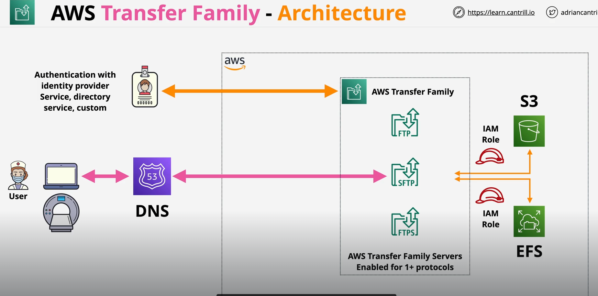

## AWS Transfer Family
- Managed file transfer service - Supports transferring TO or FROM S3 and EFS
- Provides managed "servers" which support protocols, allow you to upload or download data to and from EFS or S3
- If you need to access EFS or S3 using non native protocol, this product allows you to interact with EFS and S3 using number of common protocol
- FTP - Unencrypted file transfer
- FTPS - File transfer with TLS encryption
- Secure Shell FTP (SFTP) - File transfer over SSH
- Applicability Statement 2 (AS2) - Strcutured B2B Data
- Identities - Service Managed, Directory Service, Custom(lambda/APIGW)
- Managed File Transfer Workflows - Serverless file workflow engine (Define a workflow as to what happens when a file is uploaded to the product)

- When Client only use SFTP protocol not native to either S3 or EFS
- Servers in the AWS Transfer Family are configured to communicate with our backend storage resources using IAM role
- Client then access the storage using a protocol they support which is not the native S3 or EFS access methods
- They can be authenticated via identity provider service, directory service or custom identity store

### Endpoint Type
- Public, VPC-Internet, VPC-Internal

#### Public
- For Public, Endpoint is running in the AWS public zone (accessible from public internet)
- No networking, no VPC consideration 
- But only supported protocol is SFTP
- Endpoint has a dynamic IP(can change) so should use DNS to access it 
- It means that cannot control access via IP lists such as NACL or SG

#### VPC-Internet
- Running in VPC
- Supported protocol is SFTP, FTPS and AS2
- Can be connected to VPC via direct connect or VPN 
- Static IP is provided which means SG and NACL can be used to control access
- Allocated with an static Elastic IP which allows internet access in addition to the corporate network DIRECTLY to VPC

#### VPC-Internal
- Running in VPC
- Ssupported Protocol is SFTP, FTP, FTPS and AS2
- Can be connected to VPC via direct connect or VPN 
- Static IP is provided which means SG and NACL can be used to control access

#### Extra pointers
- Multi-AZ = Resilient and Scalable
- Provisioned Server per hour $ + data transferred $
- FTP and FTPS protocol can only be used with Directory Service or Custom IDP only
- FTP - VPC only (cannot be public)
- AS2 VPC Internet/Internal Only
- If you need to access S3/EFS, but with existing protocols
- integrating with existing workflows
